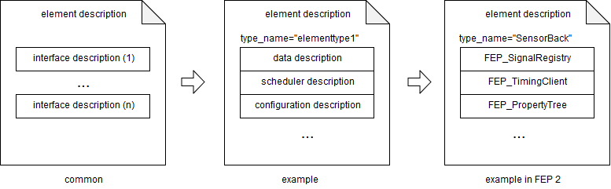
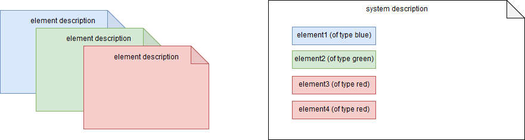
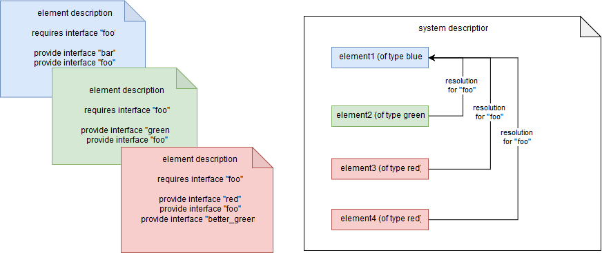
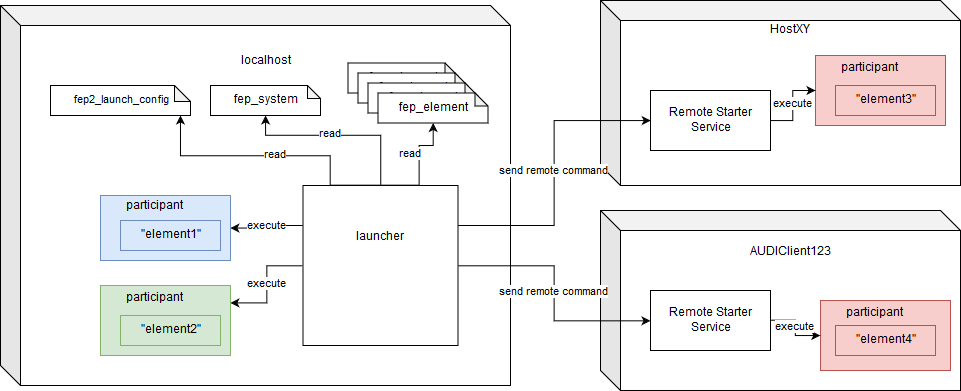
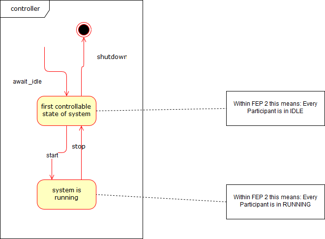

<!---
  Copyright @ 2019 Audi AG. All rights reserved.
  
      This Source Code Form is subject to the terms of the Mozilla
      Public License, v. 2.0. If a copy of the MPL was not distributed
      with this file, You can obtain one at https://mozilla.org/MPL/2.0/.
  
  If it is not possible or desirable to put the notice in a particular file, then
  You may include the notice in a location (such as a LICENSE file in a
  relevant directory) where a recipient would be likely to look for such a notice.
  
  You may add additional accurate notices of copyright ownership.
  -->
# FEP Meta Model  {#MetaModel}

The *FEP Meta Model* defines a standard how to describe, deploy and run distributed FEP Systems. The standard is independent from FEP SDK but will be implemented for FEP SDK 2 and will be also supported in FEP SDK 3. It is able to describe distributed systems which are not using the FEP SDK as communication middleware.

It encompasses description formats for systems, elements, properties and launch configurations,
but also defines the base tooling required to launch and run such systems in a uniform fashion.

Please note, that GUI based tooling for a more convenient usage of the Meta Model is neither part of the FEP Meta Model nor the FEP SDK, but might be provided by other products such as the VW MDS Tooling oder FEP Utility.

## Description formats

### FEP Element Descriptions

*FEP Elements* are functional units with a specified type name like "Sensor", "Driver" or "AdaptiveCruiseControl". A FEP Element is a composition of provided *external* interfaces.

The *FEP Element Description* will describe a kind or concrete type of the FEP Element, its provided external interfaces (i.e. data in/out descriptions, scheduler descriptions, configuration descriptions) and its required interfaces usually provided by another element (see *FEP System Description*). 

Every FEP Element within a FEP System must have an element type described in a file conforming to the schema [fep_element.xsd](xsd/fep_element.xsd)

It contains
- Meta information (description, author ...)
- A list of component interfaces with respective configuration properties (e.g. DDL or mapping files)
- A list of dependencies to other elements interfaces (e.g. VUProvider)

It does *NOT* contain specific configuration for parameters, properties.
The element description is *NOT* the implementation, but the common description of it.

#### Example in FEP 2
In FEP 2 the data interface is called *FEP_SignalRegistry*. It will describe the data in signals and the data out signals like: 
    
    <interface>
        <name>FEP_SignalRegistry</name>
        <version>2.1.0</version>
        <properties>
            <property>
                <name>Input/FrontDistance/Type</name>
                <type>string</type>
                <value>tSensorInfo</value>
            </property>
            <property>
                <name>Input/BackDistance/Type</name>
                <type>string</type>
                <value>tSensorInfo</value>
            </property>
            <property>
                <name>Output/DriverCommand/Type</name>
                <type>string</type>
                <value>tDriverCtrl</value>
            </property>
            <property>
                <name>SignalDescriptionFiles</name>
                <type>string</type>
                <value>descriptions/fep_vu.description;descriptions/timing_example.description</value>
            </property>
        </properties>
    </interface>

**Note**: The element description file is a specification of an element type. It is *NOT* a concrete implementation 
but describes the requirements for an element may be implemented within a MLSL Model, an ADTF Filtergraph or an ADTF 
Session, etc.

### FEP System Description

#### Description
A *FEP System* will instanciate concrete *FEP Elements* described by the *FEP Element Description*.

A *FEP System Description* is described in a single file conforming to the schema [fep_system.xsd](xsd/fep_system.xsd)

It contains
- global system properties
- A list of elements instantiated from FEP Element descriptions
- default requirement resolutions that will be applied for those elements does not resolve
  the requirement by itself.

A system description is also a primary input for the launcher tool (see below)

**Note**: The element description files are required for a valid system description. They contain the *provided* and *required* interfaces. 

#####

#### Example in FEP 2 
The Timing Master configuration of FEP 2 uses this meta model functionality. 
* Each element of FEP 2 requires a *"FEP_TimingMaster"*
* The resolution for the required interface *"FEP_TimingMaster"* is "TimingMaster"
* This will result in an order of initialization.

Example for the definition of the requirements within the element description:

    <type_name>Driver</type_name>
    <!-- ... -->
    <interfaces>
         <!-- ... -->
    </interfaces>
    <requirements>
        <requirement>
            <name>FEP_TimingMaster</name>
            <version>2.1.0</version>
        </requirement>
    </requirements>
    <!-- ... -->

Example for the system description:

    <!-- ... -->
    <elements>
        <element>
            <name>TimingMaster</name>
            <type>TimingMaster</type>
            <type_version>2.1.0</type_version>
            <interface_properties />
            <requirement_resolutions />
        </element>
        <element>
            <name>DriverInstance</name>
            <type>Driver</type>
            <!-- ... -->
            <requirement_resolutions>
                <requirement_resolution>
                    <requirement>FEP_TimingMaster</requirement>
                    <resolution>TimingMaster</resolution>
                </requirement_resolution>
            </requirement_resolutions>
        </element>
    </elements>
    <!-- ... -->

### (FEP 2) Launch Configuration
To instantiate and startup a *FEP System*, all element instances has to be launched. Within FEP 2 the execution of the *FEP Participant* will also the element it is representing.
The configuration of this launch is contained in a single file conforming to the schema [fep2_launch_config.xsd](xsd/fep2_launch_config.xsd)

Within FEP 2 one *FEP Participant* is able to contain and load exactly one *FEP Element*. 
To launch a *FEP Participant* you will have 2 different options (at the moment): 

#### Launch by running a local executable 
Definition of a command to start the participant representing one element as local process 

##### Example
    <!-- .... -->
    <participant>
        <name>Driver</name>
        <host>localhost</host>
        <working_dir>.</working_dir>
        <arguments>--name $(name)</arguments>
        <executable>../demo_timing_driver</executable>
    </participant>
    <!-- .... -->

#### Launch by sending commands to a remote starter service 
Definition of a command which will be sent to a remote starter service at a far system (*NOT* localhost). Within FEP 2 this application is part of the *FEP Utility* and is called *FEP Remote Starter*. For more information on how to configure an alias for an application to be started via *FEP Remote Starter* see the *FEP Utility* manual.

##### Example fep2_launch_config
    <!-- .... -->
    <participant>
        <name>Driver</name>
        <host>HostXY</host>    <!--  this will define a remote starter communication on launching -->
        <working_dir>.</working_dir>
        <arguments>--name $(name)</arguments>
        <remote_starter_alias>DemoTimingDriver@1.0</remote_starter_alias>      <!-- specifying the version is optional -->
    </participant>
    <!-- .... -->

##### Example aliaslist
    <!-- .... -->
    <alias name="DemoTimingDriver">
        <path>/path/to/demo_timing_driver</path>
        <path version="1.0">/path/to/demo_timing_driver</path>
    </alias>
    <!-- .... -->

### Properties
To parameterize FEP Systems during launch, sets of properties can be described in files conforming to
the schema [fep_properties.xsd](xsd/fep_properties.xsd)

Properties from property descriptions, element interfaces in element descriptions or system properties/element
instances in system descriptions all use a path naming schema where path segments are separated by a single forward slash ('/')

<pre><b>Example:</b> MyProperty, Input/SignalName/Type, MyVTDParticipant/VUProvider/strScenarioPath</pre>

Values of system properties are accessible to interface properties. They can be referenced to within the value
tag using the dollar sign followed by the referenced property name enclosed in single parentheses.

<pre><b>Example:</b> $(SomeOtherProperty)</pre>

Note that the types of the referenced system property and the referencing interface property must match.

### Supported interfaces & requirements

The supported interfaces and requirement interfaces are defined by the implementation of the meta model.
Please see the respective product documentation (e.g. FEP Tooling in the FEP SDK 2 documentation)

## Minimal tooling

The FEP Meta Model defines two command-line applications to work with FEP Systems which are described
using the formats specified above. They divide the life-time of a system in two phases: launching & controlling

**Note**: The definitions below specify the CLI and the expected behavior of the tools.
The actual implementations are provided by the product (e.g. FEP SDK 2)

### Launcher

The launcher brings the system into a controllable state. This involves starting the participants and
applying any necessary configuration. The first controllable state is also called **IDLE**.

The launcher takes as inputs the FEP System Description (see above) and all FEP Element Descriptions, a name for the system instance and a FEP 2 Launch Configuration.
Optionally, it can also apply additional property files and set environment variables for the participants.

<table>
    <tr>
        <th>CLI Option</th>
        <th>Alternative</th>
        <th>Description</th>
    </tr>
    <tr>
        <td><pre>--name &lt;system_name&gt;</pre></td>
        <td><pre>-n</pre></td>
        <td>Specifies the system instance name (mandatory)</td>
    </tr>
    <tr>
        <td><pre>--system &lt;system_description&gt;</pre></td>
        <td><pre>-s</pre></td>
        <td>Specifies the system description file (mandatory)</td>
    </tr>
    <tr>
        <td><pre>--element &lt;element_description&gt;</pre></td>
        <td><pre>-e</pre></td>
        <td>Specifies an element description file (mandatory for each contained element in the system)</td>
    </tr>
    <tr>
        <td><pre>--configuration &lt;launch_configuration&gt;</pre></td>
        <td><pre>-c</pre></td>
        <td>Specifies the launch configuration file (mandatory)</td>
    </tr>
    <tr>
        <td><pre>--properties &lt;properties_description&gt;</pre></td>
        <td><pre>-p</pre></td>
        <td>Specifies a property description file (optional)</td>
    </tr>
    <tr>
        <td><pre>--environment &lt;variable&gt;=&lt;value&gt;</pre></td>
        <td></td>
        <td>Specifies an environment value to be made available for all launched participants (optional)</td>
    </tr>
    <tr>
    <td><pre>--timeout &lt;timeout[ms]&gt;</pre></td>
    <td><pre>-t</pre></td>
    <td>Specifies a base waiting time in ms that is used to wait for a single participant or system or transition. 
    The waiting time is used in different situations like setting properties, waiting for a response or state etc. (optional, default timeout 2000ms)</td>
    </tr>
</table>

After physically starting the participants according to the launch configuration, the launcher is expected to

- Apply any properties from the system configuration
- Apply any requirement resolutions from the system configuration (implementation defined semantics)
- Apply any properties from property description files

After a successful start, the launcher is expected to exit with return code 0. The life time of the system instance
is not coupled to the launcher!

### Controller

The controller provides both a command-line interface (CLI) as well as a server interface to the system.
It connects to a system that has already been launched.

<table>
    <tr>
        <th>CLI Option</th>
        <th>Alternative</th>
        <th>Description</th>
    </tr>
    <tr>
        <td><pre>--name &lt;system_name&gt;</pre></td>
        <td><pre>-n</pre></td>
        <td>Specifies the system instance name (mandatory)</td>
    </tr>
    <tr>
        <td><pre>--system &lt;system_description&gt;</pre></td>
        <td><pre>-s</pre></td>
        <td>Specifies the system description file (mandatory)</td>
    </tr>
    <tr>
        <td><pre>--element &lt;element_description&gt;</pre></td>
        <td><pre>-e</pre></td>
        <td>Specifies an element description file (mandatory for each contained element in the system)</td>
    </tr>
    <tr>
        <td><pre>--command &lt;command&gt;</pre></td>
        <td><pre>-c</pre></td>
        <td>Specifies a command to be issued to the system (optional, enters server-mode if no commands are specified)</td>
    </tr>
    <tr>
    <td><pre>--timeout &lt;timeout[ms]&gt;</pre></td>
    <td><pre>-t</pre></td>
    <td>Specifies a base waiting time in ms that is used to wait for a single participant or system or transition. 
    The waiting time is used in different situations like setting properties, waiting for a response or state etc. 
    The user defined waiting times of controller commands have a higher priority than this argument. 
    (optional, default timeout 2000ms)</td>
    </tr>
</table>

Any status messages are printed to stdout while error messages are printed to stderr.

When no command is passed via the CLI, the controller enters server mode. In this mode, commands and their
arguments are read from stdin, terminated using a new line ("\r\n"). There are no niceties like terminal
emulation or auto completion to make it easy to use this mode from other software (it is not primarily a human interface!).

If commands are passed via the CLI, the controller is expected to execute them in order and then exit again. Commands that contain a space should be
enclosed in quotes.

#### Supported commands

The FEP Meta Model defines several standard commands that any controller implementation must support.

<table>
    <tr>
        <th>Command</th>
        <th>Description</th>
    </tr>
    <tr>
        <td><pre>start [timeout (s)]</pre></td>
        <td>Brings the system from <b>IDLE</b> to the started state (<b>RUNNING</b>). No effect if the system is already started.</td>
    </tr>
    <tr>
        <td><pre>stop [timeout (s)]</pre></td>
        <td>Brings the system from <b>RUNNING</b> to the <b>IDLE</b> state, from where it can be started again or shut down. No effect if the system is already idle.</td>
    </tr>
    <tr>
        <td><pre>shutdown [timeout (s)]</pre></td>
        <td>Shuts down the system (regardless of the current state), effectively undoing the launchers work. In server mode, the controller will terminate afterwards.</td>
    </tr>
    <tr>
        <td><pre>await_idle [timeout (s)]</pre></td>
        <td>Awaits the <b>IDLE</b> state. Useful for systems that stop themselves. No effect if the system is already idle.</td>
    </tr>
</table>

